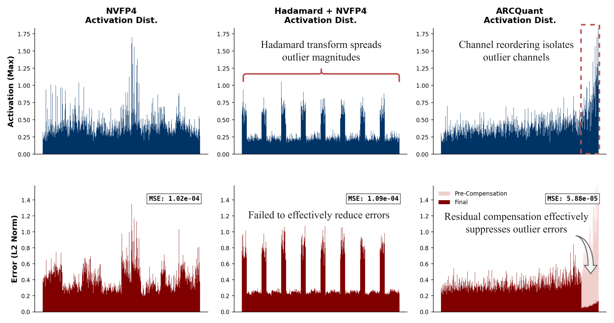

# ARCQuant: Boosting NVFP4 Quantization with Augmented Residual Channels for LLMs

<h5 align="center">

[](https://arxiv.org/abs/2601.07475)
<br>

</h5>



**ARCQuant** is a high-performance quantization framework for low-bit LLMs that improves accuracy under fine-grained formats such as NVFP4, while preserving a unified and efficient inference pipeline.

While fine-grained quantization formats such as NVFP4 effectively isolate quantization noise, activation outliers can still cause severe accuracy degradation in critical channels. Traditional mixed-precision methods address this issue by splitting computations into separate branches, which often introduces additional kernel launch overhead and memory fragmentation.

ARCQuant takes a different approach. Instead of treating outliers as a separate computation path, we leverage the structural sparsity of quantization errors in fine-grained settings. We capture the quantization residuals of critical channels and fuse them back into the computation as **Augmented Residual Channels (ARC)**.

## News

- [2026/04] 🏆 ARCQuant has been accepted to ACL 2026 Main Conference!
- [2026/03] 🔥 ARCQuant has been integrated into NVIDIA [TensorRT-LLM](https://github.com/NVIDIA/TensorRT-LLM/pull/11333), with engineering contributions from [Tracin](https://github.com/Tracin)!
- [2026/01] 🔥 ARCQuant is publicly available on arXiv! Check our paper [here](https://arxiv.org/abs/2601.07475).

## To Do

- [x] Release code for reproducing results.
- [x] Release CUDA kernels for NVFP4.
- [x] Support [vLLM](https://github.com/vllm-project/vllm) integration.
- [ ] **Model Support**: Add support for more model families and architectures:
    - [ ] Qwen3
    - [x] Mixtral
    - [ ] Wan2.2

## Installation

```bash
conda create -n arcquant python=3.10 -y
conda activate arcquant
```
Please make sure that [CUDA 12.8](https://developer.nvidia.com/cuda-12-8-1-download-archive?target_os=Linux&target_arch=x86_64&Distribution=Ubuntu&target_version=22.04&target_type=runfile_local) is available in your environment.
```bash
git clone --recurse-submodules https://github.com/actypedef/ARCQuant.git
cd ARCQuant
pip install -r requirements.txt
```

## Usage

### Building Kernels
```bash
sudo apt-get update
sudo apt-get install python3-dev
```
```bash
conda install pybind11
pip install torch torchvision torchaudio --index-url https://download.pytorch.org/whl/cu128
```
```bash
cd kernels/
bash remake.sh
```

This process may take a few minutes.

### Preprocessing

Precomputed `reorder_indices` and `select_num` are required for quantization:
```bash
python reorder_indices.py --model /PATH/TO/YOUR/MODEL/ --samples 128 --seqlen 2048 --act_sort_metric max
```
The generated files will be saved to `./saved/`

### Accuracy Evaluation

ARCQuant supports multiple formats, including NVFP4, MXFP4, HiF4, and INT4. You can modify the `quant_type` parameter as needed.
```bash
bash evaluate.sh /PATH/TO/YOUR/MODEL/
```

## Efficiency Evaluation

FlashInfer:
```bash
cd third-party/flashinfer
python -m pip install -v .
```
vLLM-based efficiency evaluation scripts will be released in a future update.

## Citation
```
@article{meng2026arcquant,
  title={ARCQuant: Boosting NVFP4 Quantization with Augmented Residual Channels for LLMs},
  author={Meng, Haoqian and Luo, Yilun and Zhao, Yafei and Liu, Wenyuan and Zhang, Peng and Ma, Xindian},
  journal={arXiv preprint arXiv:2601.07475},
  year={2026}
}
```

## Acknowledgements

This project builds on several excellent open-source efforts. We sincerely thank the community for their contributions:
- [Atom](https://github.com/efeslab/Atom.git)
- [QuaRot](https://github.com/spcl/QuaRot)
- [TensorRT-LLM](https://github.com/NVIDIA/TensorRT-LLM)
- [FlashInfer](https://github.com/flashinfer-ai/flashinfer/tree/main)
- [CUTLASS](https://github.com/NVIDIA/cutlass)
- [lm-evaluation-harness](https://github.com/EleutherAI/lm-evaluation-harness)

